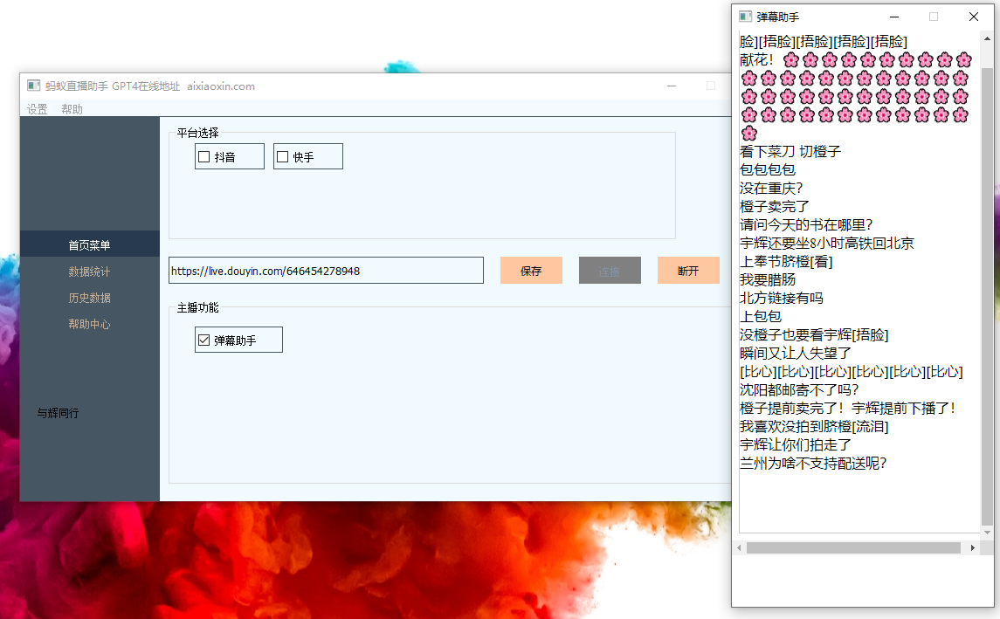
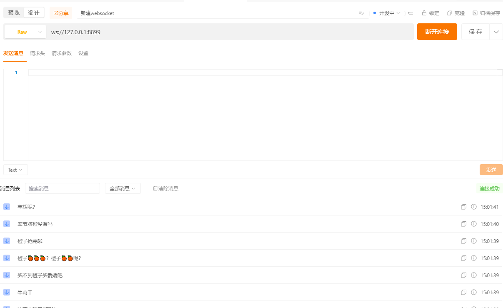

# 直播助手工具
准备写个直播助手工具，先挖个坑

最终目标是根据弹幕，礼物，点赞，关注，等操作去触发各种好玩的东西
比如 触发视频，语音，按键，物联网设备 等等

后面要加入抖音直播，虎牙，bilibili.....
# 环境大于3.10应该都可以

```
创建环境
conda create --name your_env_name python=3.10
激活环境
source activate your_env_name
pip安装需要的包 运行时候有缺失包报错，安装对应的就行了
pip install -r requirement.txt

运行项目
python main.py
```

桌面版展示：

任意ws客户端都能连接：


# 注意注意
注意：这只是Python学习研究直播技术的仓库，不是黑客。请勿用于非法用途。一切违法行为后果自负！